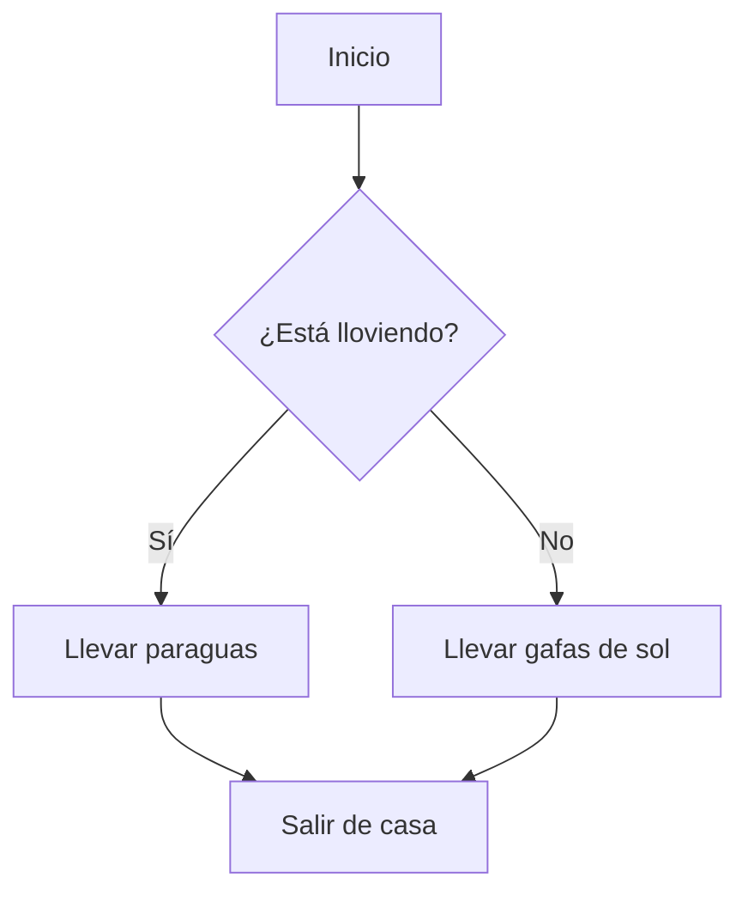
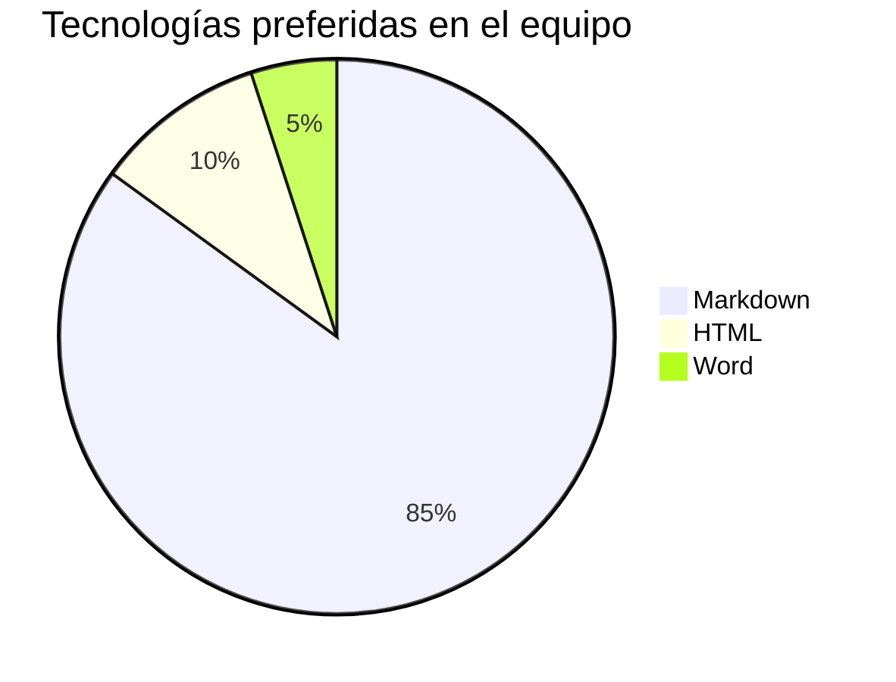

# Diagramas con Mermaid.js

Visualizar flujos de trabajo, arquitecturas de bases de datos o procesos lógicos suele requerir herramientas externas de diseño (como Draw.io, Figma o Visio), exportar la imagen y subirla al repositorio.

¿Qué pasaría si pudieras generar esos gráficos escribiendo simple texto plano? Eso es exactamente lo que hace **Mermaid.js**.

GitHub, GitLab y herramientas como Obsidian tienen soporte nativo para Mermaid. Esto significa que si escribes la sintaxis correcta dentro de un bloque de código, el motor no mostrará el texto, sino un diagrama interactivo.

## 1. ¿Cómo se usa?

Para indicarle a Markdown que quieres crear un diagrama, debes abrir un bloque de código de tres comillas y usar la palabra clave `mermaid` como identificador de lenguaje.

## 2. Diagramas de Flujo (Flowcharts)

Es el tipo de diagrama más común. Se usa para representar algoritmos o procesos paso a paso. Se inicia con la palabra `graph` o `flowchart` seguida de la dirección (ej. `TD` para Top-Down o de arriba a abajo, `LR` para Left-Right o de izquierda a derecha).

**Sintaxis (lo que debes escribir):**
````markdown

````

**Resultado (lo que mostrará GitHub):**


*(Nota: En GitHub o editores compatibles como Obsidian, el bloque superior te muestra el código fuente, y el bloque inferior se renderiza automáticamente como el diagrama).*

## 3. Gráficos Circulares (Pie Charts)

Mermaid soporta muchísimos tipos de diagramas (secuencia, Gantt, clases, estado...). Otro muy sencillo y útil para la documentación es el gráfico circular.

Se inicializa con la palabra clave `pie` y luego se definen las etiquetas y sus valores numéricos correspondientes.

**Sintaxis (lo que debes escribir):**
````markdown

````

**Resultado (lo que mostrará GitHub):**


> **🔥 Truco Pro:** La sintaxis de Mermaid es muy extensa y potente. Si quieres probar tus diagramas en tiempo real antes de subirlos a tu repositorio, te recomendamos usar su editor online gratuito: [Mermaid Live Editor](https://mermaid.live/).